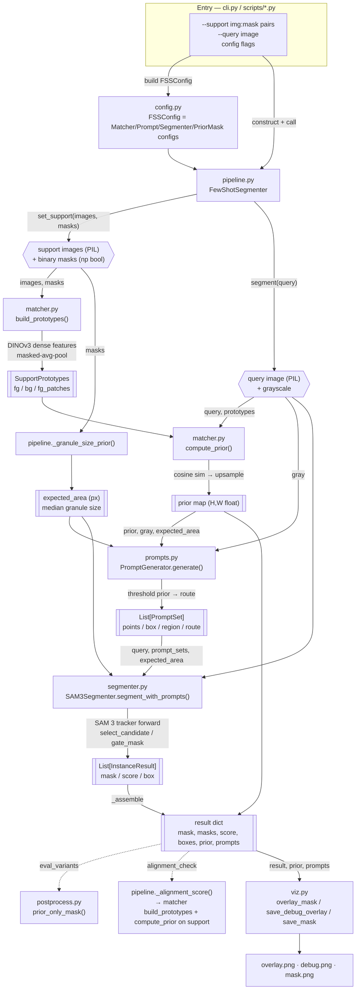

# FSS pipeline — data flow

Training-free few-shot segmentation: **DINOv3 match → prompt derivation → SAM 3
refine**. All models are frozen; everything below is inference. This documents what
data is passed to which file/function.

```
support(images+masks) ──DINOv3 match──▶ prototypes
query image ──DINOv3 match──▶ prior map ──▶ SAM 3 prompts ──▶ SAM 3 ──▶ final mask
```

## Flowchart



## Stage-by-stage: inputs → file → outputs

| # | stage | file · function | inputs passed in | outputs |
|---|---|---|---|---|
| 0 | entry / config | `fss/cli.py` (`python -m fss`), `scripts/run_fertilizer_test.py`, `scripts/run_unseen_visuals.py` | CLI flags, `--support img:mask`, `--query` | builds `FSSConfig`, constructs `FewShotSegmenter`, calls `set_support`/`segment`, hands `result` to viz |
| — | config | `fss/config.py` · `FSSConfig` | flag values | `MatcherConfig`, `PromptConfig`, `SegmenterConfig`, `PriorMaskConfig` (read live by every stage) |
| 1 | orchestration | `fss/pipeline.py` · `FewShotSegmenter` | `config`, support pairs, query | drives stages 2–6, returns `result` dict |
| 2a | build prototypes | `fss/matcher.py` · `build_prototypes(images, masks)` | support **images (PIL)** + **masks (np bool)** | `SupportPrototypes` (fg/bg vectors, fg patches) — cached |
| 2b | granule size prior | `fss/pipeline.py` · `_granule_size_prior(masks)` | support **masks** | `expected_area` (median connected-component px) — cached |
| 3 | prior map | `fss/matcher.py` · `compute_prior(query, protos)` | **query image (PIL)** + `SupportPrototypes` | `prior` map `(H,W)` float, normalized to [0,1] |
| 4 | prompt derivation | `fss/prompts.py` · `PromptGenerator.generate(prior, gray, expected_area)` | **`prior`**, **`gray`** (query grayscale), **`expected_area`** | `List[PromptSet]` (positive/negative points, box, region, route, density) |
| 5 | SAM 3 refine | `fss/segmenter.py` · `segment_with_prompts(image, prompt_sets, expected_area)` | **query image (PIL)**, **`prompt_sets`**, **`expected_area`** | `List[InstanceResult]` (mask, SAM score, box) |
| 6 | assemble | `fss/pipeline.py` · `_assemble(...)` | query, prior, prompt_sets, instances | `result` dict: `mask` (union), `masks`, `score`, `boxes`, `prior`, `prompts` |
| 7a | (opt) prior-only variant | `fss/postprocess.py` · `prior_only_mask(prior, cfg, gray)` | `prior`, `PriorMaskConfig`, `gray` | diagnostic threshold-only mask |
| 7b | (opt) alignment check | `fss/pipeline.py` · `_alignment_score(query, pred_mask)` | predicted mask + cached support → reuses `build_prototypes`/`compute_prior` | reverse-IoU confidence (telemetry; never alters mask) |
| 8 | metrics | `fss/eval.py` · `binary_iou` / `precision_recall_iou` | masks vs GT | IoU / precision / recall |
| 9 | visualize / save | `fss/viz.py` · `overlay_mask` / `save_debug_overlay` / `save_mask` | query, `result["prior"]`, `result["prompts"]`, `result` | `*_overlay.png`, `*_debug.png` (query·prior·prompts·mask), `*_mask.png` |

## Prompt derivation branch (stage 4, `prompts.py`)

`generate()` thresholds the prior into a foreground mask, then picks ONE strategy
(config-driven). Each yields `PromptSet`s consumed identically by SAM 3:

| config flag | method | what SAM 3 receives | best for |
|---|---|---|---|
| `router` | `_router_prompts` | per prior-component: area+solidity gates → dense uses `_prompts_for_blob`, scattered uses `_per_granule_prompts` | mixed images (opt-in) |
| `per_granule_prompts` | `_per_granule_prompts` | one (point + tiny box + negs) per brightness seed | **scattered granules (default)** |
| `component_prompts` | `_component_prompts` | points (+box) per 8-connected component | — |
| *(none)* | `_prompts_for_blob` | tight box + peak points per prior blob | dense piles |

## Key principle

The DINOv3 **prior only localises and (optionally) routes** — it picks *where* andok
*which strategy*. **SAM 3 owns every mask boundary.** The prior's blobby shape must
never become the output shape; selection/gating may only pick or reject a SAM
candidate, never grow or reshape it.
